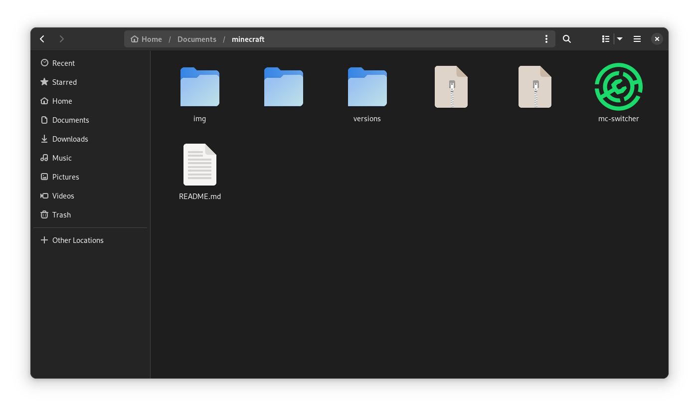
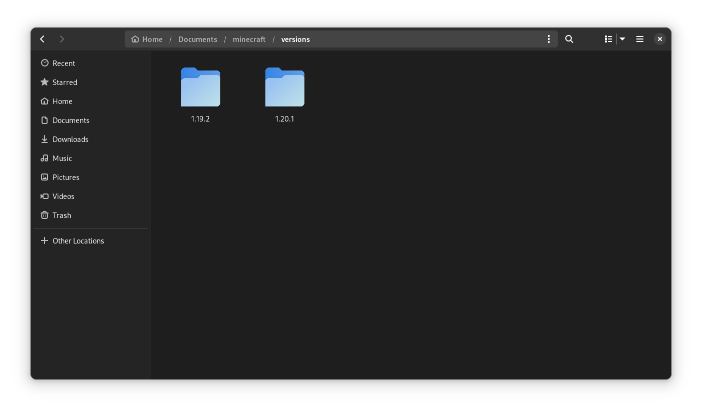

# Minecraft mods switcher

Simple and structured bash script client

## Preamble

If you play multiple versions of Minecraft 
If you have to add, remove and move mods every time depending on the desired version 
and you are lazy to do it manually...

I wrote this script that will do it for you

### Script

| file                    | SHA256                                                           |
| ----------------------- | ---------------------------------------------------------------- |
| [script](./mc-switcher) | 0fbe8ff9d5b242ad4f4b6ba53b56fb6a387db1bf8950175b9357d34cf0767113 |

### Structure

In `~/Documents/` I created `minecraft/` folder, which contains useful files like installers, shaders and *mods*.

Mods are organized in sub-folders under the parent `versions/` folder, distinguishing each folder by version.

### Video demo

<video src="img/demo.mp4" controls></video>
